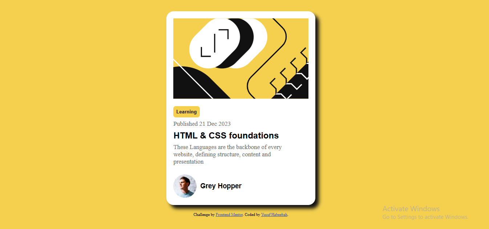

# Frontend Mentor - Blog preview card solution

This is a solution to the [Blog preview card challenge on Frontend Mentor](https://www.frontendmentor.io/challenges/blog-preview-card-ckPaj01IcS). Frontend Mentor challenges help you improve your coding skills by building realistic projects. 

## Table of contents

- [Overview](#overview)
  - [The challenge](#the-challenge)
  - [Screenshot](#screenshot)
  - [Links](#links)
 - [Author](#author)
## Overview

### The challenge

Users should be able to:

- See hover and focus states for all interactive elements on the page

### Screenshot

### Links

- Solution URL:(https://github.com/YusufHabeebah0409/blog-preview-card-main)
- Live Site URL: (https://blog-preview-card-main-hazel-five.vercel.app/)

### Built with

- Semantic HTML5 markup
- CSS custom properties
- Flexbox

## Author

- Frontend Mentor - [@yourusername](https://www.frontendmentor.io/profile/YusufHabeebah0409)
- Twitter - (https://x.com/Habeebahpe)